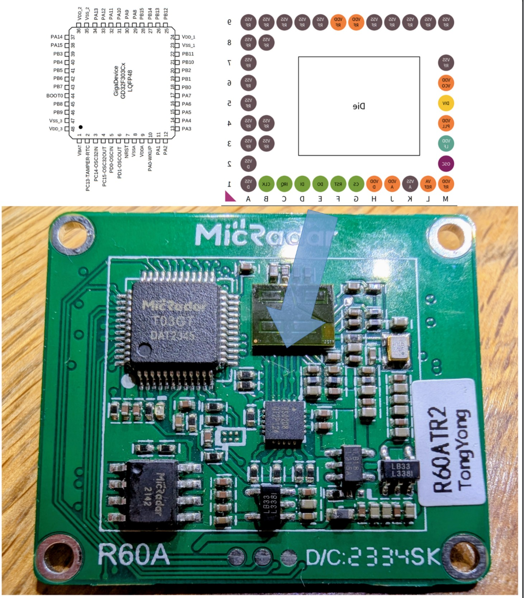
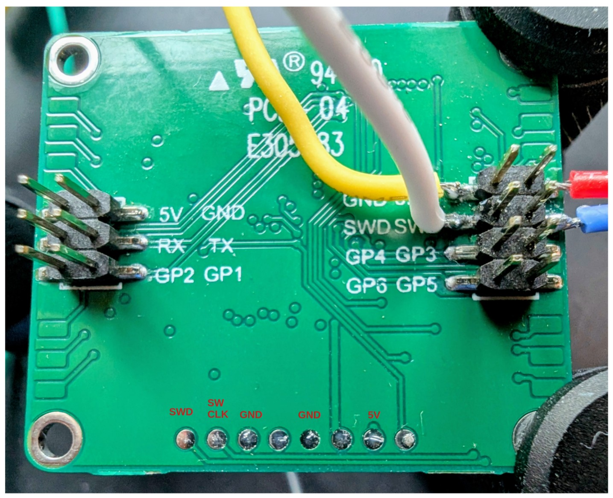

# Reverse Engineering the MicRadar RA60ATR2 60GHz FMCW Radar

## Hardware

### PCB Front



### PCB Back



### Radar: Infineon BGT60TR13C

[Infineon BGT60TR13C](https://www.infineon.com/part/BGT60TR13C#documents)

### TXCO

Feeds the 80MHz required by the radar IC.

Looking into the BGT60TR13C datasheet confirms this.

### Level Shifter: RS0208

No Datasheet available. 

Most likely it's a bidirectional level shifter handling SPI, IRQ, RST and GPIO according to a [Application Note](https://www.infineon.com/assets/row/public/documents/24/44/infineon-ug091519-radar-baseboard-mcu7-usermanual-ja.pdf).


### Microcontroller: Most likely a GD GD32F303Cx variant

The housing of the microcontroller was etched off. But on the bottom side they exposed the SWD and SWCLK pins. Means: we most likely can access the device using its debug interface and read out the ID registers.

```
# pyocd commander
Connected to CoreSightTarget [Running]: 52FF6...
```

Very good. Debug interface not deactivated.


#### CPUID (0x410FC241)

```
pyocd> read32 0xE000ED00
e000ed00:  410fc241    |A..A|

0x41  -> ARM
0x0F  -> Revision
0xC   -> ARMv7-M
0xC24 -> CM4
0x1   ->  Revision
```

We we have a Cortex M4.

#### DEBUGMCU (0xE0042000)

```
pyocd> read32 0xE0042000
e0042000:  70050346

Device ID = bits [11:0] of lower half (0x0346 & 0xFFF) = 0x346
Revision ID = bits [15:12] of lower half ((0x0346 >> 12) & 0xF) = 0x0 (revision 0)
```

0x346 smells like a GD GD32F3x0x.


#### Flash Size (0x1FFFF7E0)

```
pyocd> read16 0x1FFFF7E0
1ffff7e0:  0400
```

We have 1MB Flash.

 
#### Assumption

I assume (Device ID + Flash size + Pins) that the used uC is a GD GD32F303Cx variant. 

Lets work with the 1MB Flash version (GD GD32F303CG) for now.

## Communication

The SPI between the microcontroller and radar IC runs at 15MHz.

The Radar sends an IRQ to the microcontroller which then starts the readout process.

No decoding now for as this speed maxes out my Cypress FX2 logic analyzer  :-(

## Firmware

### Dumping the Firmware 

Using that knowledge a standardized .pack file can be downloaded from [here](https://www.keil.arm.com/packs/gd32f30x_dfp-gigadevice/devices/)


```
# pyocd cmd --pack "GigaDevice.GD32F30x_DFP.2.2.1.pack"  -t "gd32f303cg" 
(...)
Connected to GD32F303CG [Running]: 52FF6D0...
```

```
pyocd> show map
 Region  Type   Start       End         Size        Access  Sector      Page       
 IROM1   Flash  0x08000000  0x080fffff  0x00100000  rx      0x00000800  0x00000400 
 IRAM1   Ram    0x20000000  0x20017fff  0x00018000  rwx     -          
     
pyocd> save 0x08000000 0x00100000 flash_dump.bin
Saved 1048576 bytes to flash_dump.bin

# md5sum flash_dump.bin 
470996685cf17ad264bd086958e6022e  flash_dump.bin
```

### Firmware Strings Analysis

```
# strings flash_dump.bin
printf_s: %n disallowed
printf: bad %n argument
printf_s: bad %s argument

constraint handler: bad message

@I:\60G_infineon\A_302code\Track_tracking_radar\sy302-2-ifx60g\2-EmbeddedSoftwareDevelopment\app\src\message_transmit_task.c

 _         _   _                  _          _ _ 
| |    ___| |_| |_ ___ _ __   ___| |__   ___| | |
| |   / _ \ __| __/ _ \ '__| / __| '_ \ / _ \ | |
| |__|  __/ |_| ||  __/ |    \__ \ | | |  __/ | |
|_____\___|\__|\__\___|_|    |___/_| |_|\___|_|_|
Build:       Jul 15 2022 14:27:26
Version:     3.1.2
Copyright:   (c) 2020 Letter

I:\60G_infineon\A_302code\Track_tracking_radar\sy302-2-ifx60g\2-EmbeddedSoftwareDevelopment\app\src\existence_judgment_task.c
I:\60G_infineon\A_302code\Track_tracking_radar\sy302-2-ifx60g\2-EmbeddedSoftwareDevelopment\network\abstract_protocol.c
I:\60G_infineon\A_302code\Track_tracking_radar\sy302-2-ifx60g\2-EmbeddedSoftwareDevelopment\app\src\read_data_task.c
I:\60G_infineon\A_302code\Track_tracking_radar\sy302-2-ifx60g\2-EmbeddedSoftwareDevelopment\bsp\src\bsp_flash.c
I:\60G_infineon\A_302code\Track_tracking_radar\sy302-2-ifx60g\2-EmbeddedSoftwareDevelopment\user\main.c
SYSTEMVIEW: Could not record task information. Maximum number of tasks reached.
N=FreeRTOS Demo Application,D=Cortex-M4,O=FreeRTOS

@Zone-0 Write password authentication failed
{"p":"s3ue366p7mm3qbe6","v":"1.0.0","m":0}
{"p":"r0wminavxzpacebr","v":"1.0.1","m":0}
[Debug]Assert failed: %s, line %u
Warning: Command is too long
{"p":"oealnfp2","v":"1.0.1","m":0}
 Zone-0 Authentication failed
show command info
help [cmd]
existence_judgment_task_task
can't set read only var
Please input password:
Communication failure
Cw0881_Check failure
message_transmit_task
$ F2
 start_task_create
Command List:
Command not Found
can't set pointer
command help of 
password error
 PAC %d %x
I#15=SysTick
Var List:
User List:
Key List:
 is not a var
Var not Fount
default user
list all user
list all cmd
list all var
list all key
clear console
read_data_task
systerm timer
bsp_init_task
app_create_task
Terminal
00000000000
00000000000
Return: 
backspace
backspace
v01.00.01
00000000
 SEGGER
SysView
IDLE
CMD 
VAR 
USER
KEY 
NONE
, 0x
lucas
setVar
set var
down
right
left
delete
enter
enter
help
users
cmds
vars
keys
clear
IDLE
Tmr Svc
TmrQ
v01.00.01
v01.00.01
{"p":"s3ue366p7mm3qbe6","v":"1.0.0","m":0}
```
